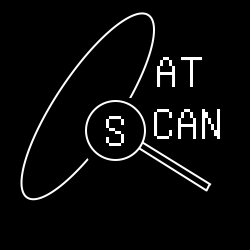
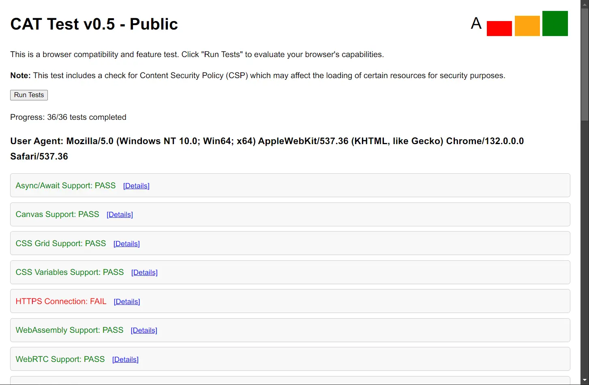

</img>

# CAT Test v0.5.2 - Public

This is a browser compatibility and feature test. Click "Run Tests" to evaluate your browser's capabilities.

## Updates

### [English Version](#english-version)
### [中文版](#中文版)

## English Version

### Changelog

- **v0.5.2 - Public**
  - Fixed bugs in MathML Support, summary Element, Sandbox Attribute, and iframe with Inline Contents tests.
  - Updated README to reflect changes.

- **v0.5-fixb - Public**
  - Added IEtest and ES6test file.
  - Removed unnecessary tests such as Payment Request API.
  - Updated README to reflect changes.

- **v0.5 - Public**
  - Added steps.
  - Added tests for DOM Manipulation.
  - Added tests for JavaScript Support.
  - Added tests for CSS Support.
  - Added tests for Web Fonts Support.
  - Added tests for Data URI Support.
  - Added tests for XMLHttpRequest Support.
  - Added tests for HTML5 Support.

- **v0.4 - Public**
  - Added tests for Network Information API.
  - Added tests for Pointer Events.
  - Added tests for Payment Request API.
  - Added tests for Web NFC.
  - Added tests for WebVR/WebXR.
  - Added tests for Web Speech API (Speech Recognition).
  - Added tests for Clipboard API.
  - Added tests for Web Push Notifications.
  - Added tests for File System Access API.
  - Added tests for Audio Worklet API.
  - Added tests for Background Sync API.
  - Added tests for Web Bluetooth API.

- **v0.3 - Public**
  - Added IP address display.
  - Added SVG support test.
  - Improved toggleDetails function for better visibility handling.
  - Added note about CSP check affecting resource loading.

- **v0.1 - Private**
  - Added support for async/await.
  - Added support for Canvas.
  - Added support for CSS Grid.
  - Added support for CSS Variables.
  - Added support for HTTPS connection.
  - Added support for WebAssembly.
  - Added support for WebRTC.
  - Added support for Service Worker.
  - Added support for CSP.
  - Added support for LocalStorage.
  - Added support for IndexedDB.
  - Added support for Geolocation API.
  - Added support for WebSockets.

### Usage

1. Open the `index.html` file or visit https://cat-test.efish.top/.
2. Click the "Run Tests" button to run the tests.
3. View the test results and details.

### Test Features

The following test features are currently implemented:

- **Async/Await Support**: Tests if the browser supports modern JavaScript async/await syntax for asynchronous programming.
- **Canvas Support**: Checks if the HTML5 Canvas API is available for drawing graphics and animations.
- **CSS Grid Support**: Verifies if the browser supports CSS Grid for advanced layout designs.
- **CSS Variables Support**: Ensures the browser supports CSS custom properties (variables).
- **HTTPS Connection**: Confirms if the page is loaded over a secure HTTPS connection.
- **WebAssembly Support**: Checks for WebAssembly, which enables high-performance applications in the browser.
- **WebRTC Support**: Tests for WebRTC, allowing peer-to-peer communication, such as video calls.
- **Service Worker Support**: Verifies if the browser supports Service Workers for offline capabilities and push notifications.
- **CSP Support**: Tests Content Security Policy (CSP) implementation to prevent unsafe resources.
- **LocalStorage Support**: Checks if the browser supports LocalStorage for storing data locally.
- **IndexedDB Support**: Verifies if the browser supports IndexedDB for storing large amounts of structured data.
- **Geolocation API Support**: Tests if the browser supports the Geolocation API for accessing the device's location.
- **WebSockets Support**: Checks if the browser supports WebSockets for real-time communication.
- **Flexbox Support**: Verifies if the browser supports CSS Flexbox for flexible layouts.
- **ES6 Support**: Checks if the browser supports ECMAScript 6 (ES6) features.
- **WebGL Support**: Tests if the browser supports WebGL for 3D graphics rendering.
- **SVG Support**: Tests if the browser supports SVG (Scalable Vector Graphics) for rendering vector images.
- **Network Information API**: Tests if the browser supports the Network Information API, providing details about the user's network connection.
- **Pointer Events Support**: Checks if the browser supports Pointer Events, used for handling mouse, touch, and pen input in a unified way.
- **Web NFC Support**: Tests if the browser supports the Web NFC API for enabling Near Field Communication interactions.
- **WebVR/WebXR Support**: Checks if the browser supports WebVR or WebXR for Virtual Reality and Augmented Reality experiences.
- **Web Speech API - Speech Recognition**: Tests if the browser supports the Web Speech API for speech recognition, allowing voice input.
- **Clipboard API**: Checks if the browser supports the Clipboard API for reading and writing content to the clipboard.
- **Web Push Notifications**: Tests if the browser supports Web Push Notifications, allowing websites to send notifications to users.
- **File System Access API**: Checks if the browser supports the File System Access API, allowing websites to read and write files to the local file system.
- **Audio Worklet API**: Checks if the browser supports Audio Worklet API for real-time audio processing and synthesis.
- **Background Sync API**: Tests if the browser supports the Background Sync API, allowing websites to synchronize data in the background.
- **Web Bluetooth API**: Tests if the browser supports the Web Bluetooth API for connecting and interacting with Bluetooth devices.

### Contributing

If you have any suggestions or improvements, please submit an issue or pull request.

### License

This project is licensed under the Apache-2.0 License.

## 中文版

### 更新日志

- **v0.5.2 - Public**
  - 修复了 MathML 支持、summary 元素、Sandbox 属性和 iframe 内联内容测试中的错误。
  - 更新了 README 以反映更改。

- **v0.5-fixb - Public**
  - 增加了 IE 兼容性检查和 ES6 专项检查。
  - 删除了一些无关紧要的测试，比如支付请求 API。
  - 更新了 README 以反映更改。

- **v0.5 - Public**
  - 增加了阶梯。
  - 增加了对 DOM 操作的测试。
  - 增加了对 JavaScript 支持的测试。
  - 增加了对 CSS 支持的测试。
  - 增加了对 Web 字体支持的测试。
  - 增加了对 Data URI 支持的测试。
  - 增加了对 XMLHttpRequest 支持的测试。
  - 增加了对 HTML5 支持的测试。

- **v0.4 - Public**
  - 增加了对网络信息 API 的测试。
  - 增加了对指针事件的测试。
  - 增加了对支付请求 API 的测试。
  - 增加了对 Web NFC 的测试。
  - 增加了对 WebVR/WebXR 的测试。
  - 增加了对 Web Speech API（语音识别）的测试。
  - 增加了对剪贴板 API 的测试。
  - 增加了对 Web 推送通知的测试。
  - 增加了对文件系统访问 API 的测试。
  - 增加了对音频工作线程 API 的测试。
  - 增加了对后台同步 API 的测试。
  - 增加了对 Web 蓝牙 API 的测试。

- **v0.3 - Public**
  - 增加了 IP 地址显示。
  - 增加了 SVG 支持检测。
  - 改进了 toggleDetails 函数以更好地处理可见性。
  - 增加了关于 CSP 检查影响资源加载的提示。

- **v0.1 - Private**
  - 已添加对 async/await 的支持。
  - 已添加对画布的支持。
  - 已添加对 CSS 网格的支持。
  - 已添加 CSS 变量支持。
  - 已添加 HTTPS 连接支持。
  - 已添加对 WebAssembly 的支持。
  - 已添加对 WebRTC 的支持。
  - 已添加对 Service Worker 的支持。
  - 已添加对 CSP 的支持。
  - 已添加对 LocalStorage 的支持。
  - 已添加对 IndexedDB 的支持。
  - 已添加对地理位置 API 的支持。
  - 已添加对 WebSockets 的支持。

### 使用方法

1. 打开 `index.html` 文件或访问 https://cat-test.efish.top/。
2. 点击“Run Tests”按钮以运行测试。
3. 查看测试结果和详细信息。

### 测试功能

以下是当前实现的测试功能：

- **Async/Await Support**: 测试浏览器是否支持现代 JavaScript 的 async/await 语法。
- **Canvas Support**: 检查 HTML5 Canvas API 是否可用。
- **CSS Grid Support**: 验证浏览器是否支持 CSS Grid 布局。
- **CSS Variables Support**: 确保浏览器支持 CSS 自定义属性（变量）。
- **HTTPS Connection**: 确认页面是否通过安全的 HTTPS 连接加载。
- **WebAssembly Support**: 检查 WebAssembly 支持情况，以便在浏览器中启用高性能应用程序。
- **WebRTC Support**: 测试 WebRTC 支持情况，允许点对点通信，如视频通话。
- **Service Worker Support**: 验证浏览器是否支持 Service Workers，以实现离线功能和推送通知。
- **CSP Support**: 测试内容安全策略（CSP）实施情况，以防止不安全资源。
- **LocalStorage Support**: 检查浏览器是否支持 LocalStorage 以本地存储数据。
- **IndexedDB Support**: 验证浏览器是否支持 IndexedDB 以存储大量结构化数据。
- **Geolocation API Support**: 测试浏览器是否支持 Geolocation API 以访问设备位置。
- **WebSockets Support**: 检查浏览器是否支持 WebSockets 以实现实时通信。
- **Flexbox Support**: 验证浏览器是否支持 CSS Flexbox 以实现灵活布局。
- **ES6 Support**: 检查浏览器是否支持 ECMAScript 6 (ES6) 特性。
- **WebGL Support**: 测试浏览器是否支持 WebGL 以进行 3D 图形渲染。
- **SVG Support**: 测试浏览器是否支持 SVG（可缩放矢量图形）以渲染矢量图像。
- **Network Information API**: 测试浏览器是否支持网络信息 API，提供有关用户网络连接的详细信息。
- **Pointer Events Support**: 检查浏览器是否支持指针事件，用于统一处理鼠标、触摸和笔输入。
- **Web NFC Support**: 测试浏览器是否支持 Web NFC API，以启用近场通信交互。
- **WebVR/WebXR Support**: 检查浏览器是否支持 WebVR 或 WebXR，以实现虚拟现实和增强现实体验。
- **Web Speech API - Speech Recognition**: 测试浏览器是否支持 Web Speech API 进行语音识别，允许语音输入。
- **Clipboard API**: 检查浏览器是否支持剪贴板 API，以读取和写入剪贴板内容。
- **Web Push Notifications**: 测试浏览器是否支持 Web 推送通知，允许网站向用户发送通知。
- **File System Access API**: 检查浏览器是否支持文件系统访问 API，允许网站读取和写入本地文件系统中的文件。
- **Audio Worklet API**: 检查浏览器是否支持音频工作线程 API，以进行实时音频处理和合成。
- **Background Sync API**: 测试浏览器是否支持后台同步 API，允许网站在后台同步数据。
- **Web Bluetooth API**: 测试浏览器是否支持 Web 蓝牙 API，以连接和与蓝牙设备交互。

### 贡献

如果您有任何建议或改进，请提交问题或拉取请求。

### 许可证

此项目采用 Apache-2.0 许可证。

